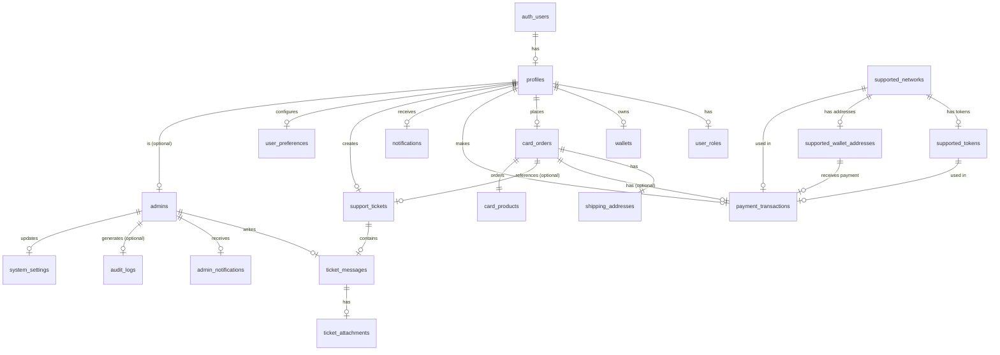

# Entity Relationship Diagram — TWallet Services

> Generated from `supabase/migrations/202607200001_initial_schema.sql`

## Mermaid ERD

## Legend

| Notation | Meaning |
|----------|---------|
| `||--||` | One-to-one |
| `||--o|` | One-to-zero-or-one |
| `||--o{` | One-to-many |
| `}|--o{` | Many-to-many |

## Key Entities

| Entity | Type | Description |
|--------|------|-------------|
| `profiles` | Core | User profiles, synced from auth.users |
| `wallets` | Core | User-connected crypto wallets |
| `card_products` | Core | Available card types with pricing |
| `card_orders` | Core | Customer orders with lifecycle |
| `payment_transactions` | Core | On-chain payment verification records |
| `support_tickets` | Support | Customer support requests |
| `notifications` | Core | User notification records |
| `audit_logs` | Admin | Append-only admin action log |
| `admins` | Admin | Admin users with RBAC roles |
